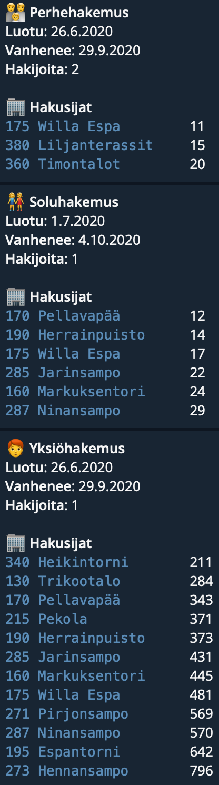

# toas-bot



toas-bot posts your TOAS queue position periodically and on-demand to Telegram.

## Running toas-bot

### Environment variables

| Key                | Default value   | Description                                   |
| ------------------ | --------------- | --------------------------------------------- |
| BOT_TOKEN          | 🚫 Required! 🚫 | `string` of Telegram bot token                |
| TOAS_USERNAME      | 🚫 Required! 🚫 | `string` of your TOAS username to ETampuuri   |
| TOAS_PASSWORD      | 🚫 Required! 🚫 | `string` of TOAS password                     |
| CRON_CHAT_IDS_FILE | `chat-ids`      | `string` of filename where chat-ids are saved |

### Run

bash

```
npm install
npm start
```

telegram

```
/start
```

This runs the periodical job, and also starts the cronjob running every hour for the channel.
